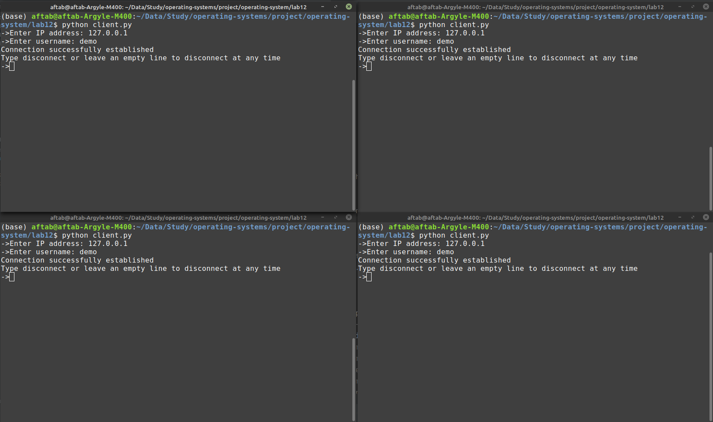
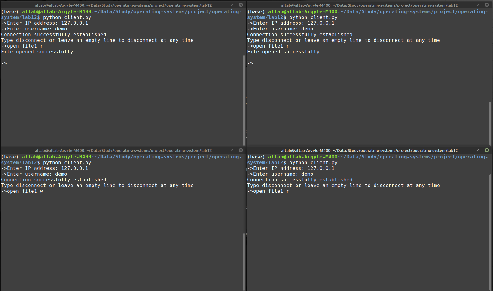
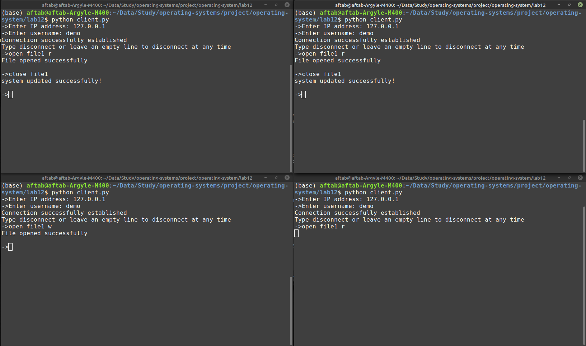

# Synchronization between readers and writers in the file system
| Name     | CMS ID  |
| -------- |-------- |
|  Aftab Akhtar    | 244301 |
| Basim Ehsan    | 267596 |
| Muhammad Abdullah Khan    | 258367 |

In this part of project, we  decided to implement the **Task-1** mentioned in our Lab manual.

## How to Run
To run the project follow these steps
Make sure you have `python >= 3.5` (lower version may need manual backlog setting)
### Running Server
- First, make sure that server is running, to run server do `python3 lab12/server.py`. It will start the server and put
it in the listening mode where it would be accepting connections.
  
### Running Client(s)
- Now, start the client(s) using `python3 lab12/client.py`. You would be prompted to enter IP address for the server. 
   
- If the server is running locally the IP would be `127.0.0.1`.

- After entering IP, you would be prompted to enter `username`. For the purpose of this lab following
accounts are created.
  
  
| Username |
| -------- |
|  demo    |
| aftab    |
| basim    |
| abdullah |


## Synchronization Algorithm
In this section, we will discuss our approach to solve the synchronization issue in our designed file_system. So for starting,
lets create a scenario and see what is expected after synchronization.

Consider multiple readers / writers appear in the following order to read / modify a file:

R1, R2, W1, R3 , . . .

In this scenario, the file will first be opened in `read` mode for both R1 and R2 whereas when W1 will appear it would have to wait
until there are no readers currently reading the file. Also, as R3 comes after W1, it would have to wait until W1 is done writing so
that latest contents of the file are served to R3. 

**Note:** A file should not open in `read` mode if a `writer` has arrived before the `reader`.

### Our Approach:
There are three semaphores used for synchronization, lets name them `writer_exists`, `reader`, `writer`.

#### Reader Side:
```jsx
wait(writer_exists)
wait(reader)
read_count++
if read_count == 1:
	wait(writer)
signal(reader)
signal(writer_exists)
		.
		.
	     reading
		.
		.
wait(reader)
read_count--
if read_count == 0:
	signal(writer)
signal(reader)
```
#### Writer Side
```jsx
wait(writer_exists)
wait(writer)
		.
		.
	     writing
		.
		.
signal(writer)
signal(writer_exists)
```

## Synchronization in Action
In this section let's demonstrate our synchronization in action. Lets first start our server and connect 4 clients to it to see
the synchronization that we implemented.

Here we see that we have connected 4 terminals with the server.


Let's open a file in read mode in two terminals and as writer in one terminal and then as read mode in another terminal.

We can see that the file when opened in write mode and read mode after that are waiting for the two reader started before to stop reading.


Now, the file opened as `writer` will be opened when both of the reader are done reading, and they close the file. It can be seen in the pictures below,


We can still see that file which was opened after writer is still waiting for the writer to close the file. So in this way our previously discussed
algorithm maintain synchronization between different readers and writers.

## Command Translation
Once, we have both the `server` and `client(s)` up and running, we can send a set of commands to the server from our clients
and get response in the client instance(s). The two tables following this section define the protocol that is being used in
communication with the server.

## File System Protocol
| Commands | Mapped Functions          | Operations                 | Usage     |
| -------- | ------------------------- | -------------------------- |-------------|
| ls       | `list_dir()`              | list all directories       |`ls`         |
| create \<file_name\>   | `create(file_name)`         | create a new file        |`create` file_name |
| delete \<file_name\>   | `delete(file_name)        ` | deletes a file           |`delete` file_name|
| mkdir \<directory\>    | `mk_dir(dir_name)         ` | makes a new directory    |`mkdir` directory |
| cd \<dir1\> \<dir2\>    | `ch_dir(dir_name)          `| change directory         |`cd` ~/ ~/demo |
| move \<path1\> \<path2\>     | `move(source, destination)` | move a file to a directory|`move` ~/demo/file1 ~/ |
| open \<file_name\> \<permissions\>     | `open_file(file_path)    `  | opens a file             |`open` file1 r (r or w) |
| close \<file_name\>   | `close_file(file_object)`   | closes a file            |`close` file1 |
| mem      | `show_memory`               | shows a memory map       |`mem` |

The above table specifies general commands that can be passed to execution from `clients`. The file specific actions table is shown below.


## File Operations Protocol
| Commands | Mapped Functions                      | Operations                   | Usage  |
| -------- | ------------------------------------- | ---------------------------- |------- |
| write    | `write_to_file(text, at=None)         ` | write data to a file         |file_name.write(text) |
| read     | `read_from_file(start=None, end=None) ` | reads data from a file       |file_name.read() |
| move     | `move_within_file(start, size, target)` | move data with in a file     |file_name.move(0, 2) |
| truncate | `truncate_file(max_size) `              | truncate a file to some size |file_name.truncate(20) |

Once a file is opened the commands to manipulate files would begin with the file name (for the file to modify) like if there is a file named `file1` then the command to write would be `file1.write(text_data)` etc.


## Executing Different Commands from Multiple Clients
Before executing commands from multiple `clients`, make sure that the `server` is up and running and the `clients` are connected
and ready. The attached screenshot shows this state of a client.


When a client is connected to the server, the server also logs that a client is requesting access to the server. The following screenshot
the `log` of the server (the last two lines show the connection).


Now that our client is ready to execute commands. We can type any command in the client terminal to execute on the server and the response
from the server would be displayed in the client window. Here is an example of output `->mem` command executed.


Now let's perform following operations to see how the protocol works and how the server `log` our actions:
  - create a file named `file1`
  - open `file1`
  - write `OS Project` in `file1`
  - read `file1`
  - close `file1`
  - display `mem`

Then show our server `log` to see how it handles each of the actions.

#### Client command execution:


#### Server logging actions:

