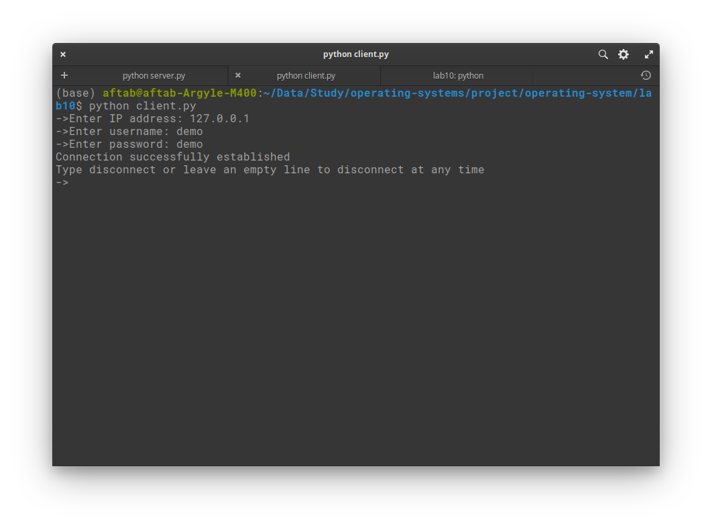
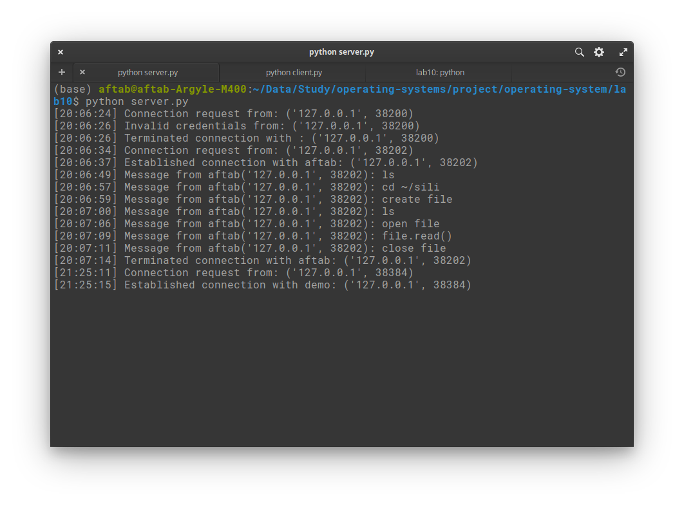
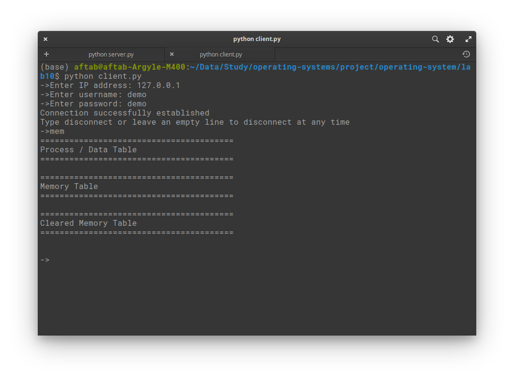
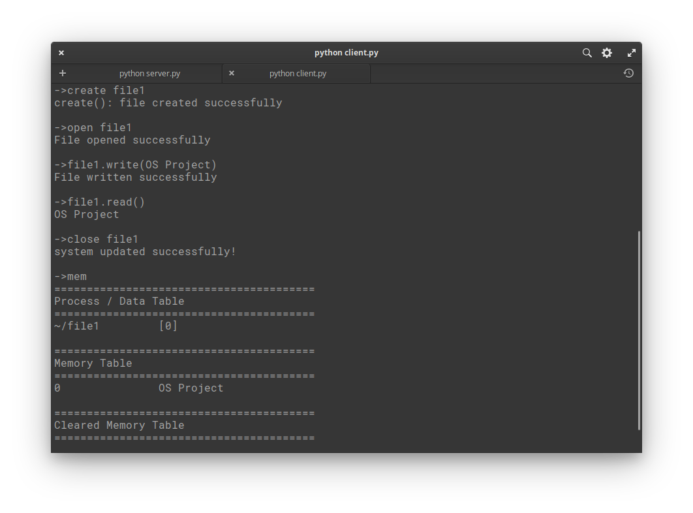
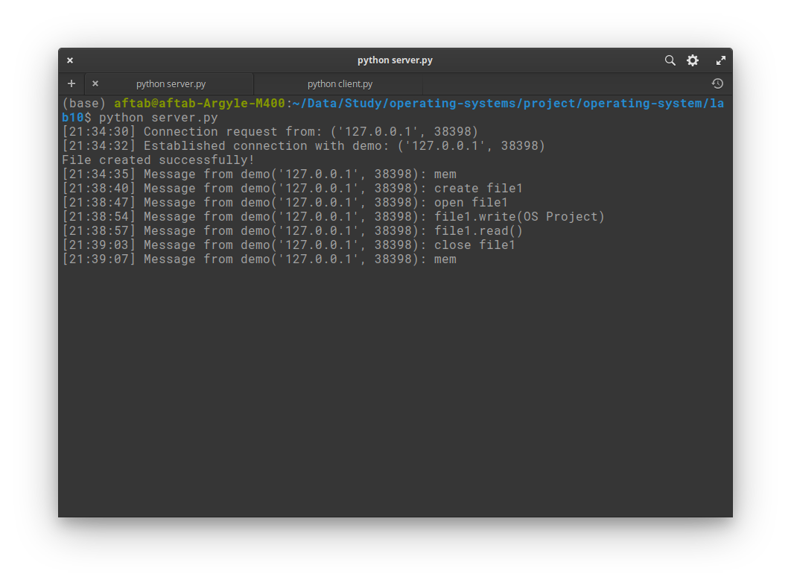

## Synchronization between readers and writers in the file system

### TODO:
- [x] Make the system use threading instead of multiprocessing
- [ ] Accept open permissions (change function and class)
- [ ] Implement reader writers in either open_file(), or the Open class
- [ ] Take only username

### How to Run
To run the project follow these steps
Make sure you have `python >= 3.5` (lower version may need manual backlog setting)
#### Running Server
- First, make sure that server is running, to run server do `python3 lab10/server.py`. It will start the server and put
it in the listening mode where it would be accepting connections.
  
#### Running Client(s)
- Now, start the client(s) using `python3 lab10/client.py`. You would be prompted to enter IP address for the server. 
   
- If the server is running locally the IP would be `127.0.0.1`.

- After entering IP, you would be prompted to enter `username` and `password`. For the purpose of this lab following
accounts are created.
  
  
| Username | Password   |
| -------- | -----------|
|  demo    | demo       |
| aftab    | demo       |
| basim    | demo       |
| abdullah | demo       |

### Command Translation
Once, we have both the `server` and `client(s)` up and running, we can send a set of commands to the server from our clients
and get response in the client instance(s). The two tables following this section define the protocol that is being used in
communication with the server.

### File System Protocol
| Commands | Mapped Functions          | Operations                 |
| -------- | ------------------------- | -------------------------- |
| ls       | `list_dir()`              | list all directories       |
| create   | `create(file_name)`         | create a new file          |
| delete   | `delete(file_name)        ` | deletes a file             |
| mkdir    | `mk_dir(dir_name)         ` | makes a new directory      |
| cd       | `ch_dir(dir_name)          `| change directory           |
| move     | `move(source, destination)` | move a file to a directory |
| open     | `open_file(file_path)    `  | opens a file               |
| close    | `close_file(file_object)`   | closes a file              |
| mem      | `show_memory`               | shows a memory map         |

The above table specifies general commands that can be passed to execution from `clients`. The file specific actions table is shown below.

### File Operations Protocol
| Commands | Mapped Functions                      | Operations                   |
| -------- | ------------------------------------- | ---------------------------- |
| write    | `write_to_file(text, at=None)         ` | write data to a file         |
| read     | `read_from_file(start=None, end=None) ` | reads data from a file       |
| move     | `move_within_file(start, size, target)` | move data with in a file     |
| truncate | `truncate_file(max_size) `              | truncate a file to some size |

Once a file is opened the commands to manipulate files would begin with the file name (for the file to modify) like if there is a file named `file1` then the command to write would be `file1.write(text_data)` etc.

### Executing Different Commands from Multiple Clients
Before executing commands from multiple `clients`, make sure that the `server` is up and running and the `clients` are connected
and ready. The attached screenshot shows this state of a client.

When a client is connected to the server, the server also logs that a client is requesting access to the server. The following screenshot
the `log` of the server (the last two lines show the connection).

Now that our client is ready to execute commands. We can type any command in the client terminal to execute on the server and the response
from the server would be displayed in the client window. Here is an example of output `->mem` command executed.

Now let's perform following operations to see how the protocol works and how the server `log` our actions:
  - create a file named `file1`
  - open `file1`
  - write `OS Project` in `file1`
  - read `file1`
  - close `file1`
  - display `mem`

Then show our server `log` to see how it handles each of the actions.

##### Client command execution:

##### Server logging actions:

